# FinMate

**Administrador de finanzas personales inteligente.**  
Lleva el control de tus ingresos, gastos y deudas, visualiza tu evolución financiera con gráficos, y gestiona tus metas en pareja.

---

## Por qué FinMate

Olvídate de las hojas de cálculo y los apuntes manuales. FinMate automatiza el registro y te da una visión clara de tu salud financiera en tiempo real: sabes cuánto ganaste, cuánto gastaste, en qué se te va el dinero y cómo evolucionas mes a mes. Con gráficos interactivos, comparativas vs el mes anterior, control de deudas con intereses y un modo pareja para metas compartidas, tomar decisiones financieras informadas deja de ser una tarea tediosa y se vuelve algo natural.

---

## Funcionalidades

- **Dashboard financiero** — resumen del mes, ingresos vs gastos, balance, distribución por categoría y evolución mensual con gráficos (Chart.js)
- **Ingresos y Gastos** — registro con categorías, filtros y paginación
- **Deudas** — control de deudas con pagos, intereses y prioridades
- **Plan de pago** — estrategias inteligentes para liquidar deudas (avalancha, bola de nieve, por prioridad)
- **Modo Pareja** — comparte finanzas con tu pareja, crea metas y contribuye
- **Notificaciones por correo** — confirmación de registro, enlace de recuperación de contraseña y recordatorios automáticos, todo en español
- **Idioma nativo** — toda la interfaz, alertas y mensajes están en español, diseñados para que cualquier persona los entienda sin tecnicismos
- **Arquitectura modular** — backend organizado por módulos independientes (categorías, movimientos, deudas, pareja), fácil de mantener y escalar
- **API REST** — backend rápido, seguro y bien documentado, construido para conectar sin esfuerzo con el frontend o cualquier app móvil

## Stack

| Capa     | Tecnologías                                               |
| -------- | --------------------------------------------------------- |
| Frontend | Vue 3, Vite, TypeScript, Vuetify, Pinia, Chart.js, Zod    |
| Backend  | Node.js, Express 5, TypeScript, MariaDB, Drizzle ORM, Zod |
| Auth     | JWT (Access + Refresh con cookie HttpOnly)                |

---

Ver `front-finmate/README.md` y `back-finmate/README.md` para documentación detallada.

---

## Capturas de pantalla

### Sin iniciar sesión

Landing

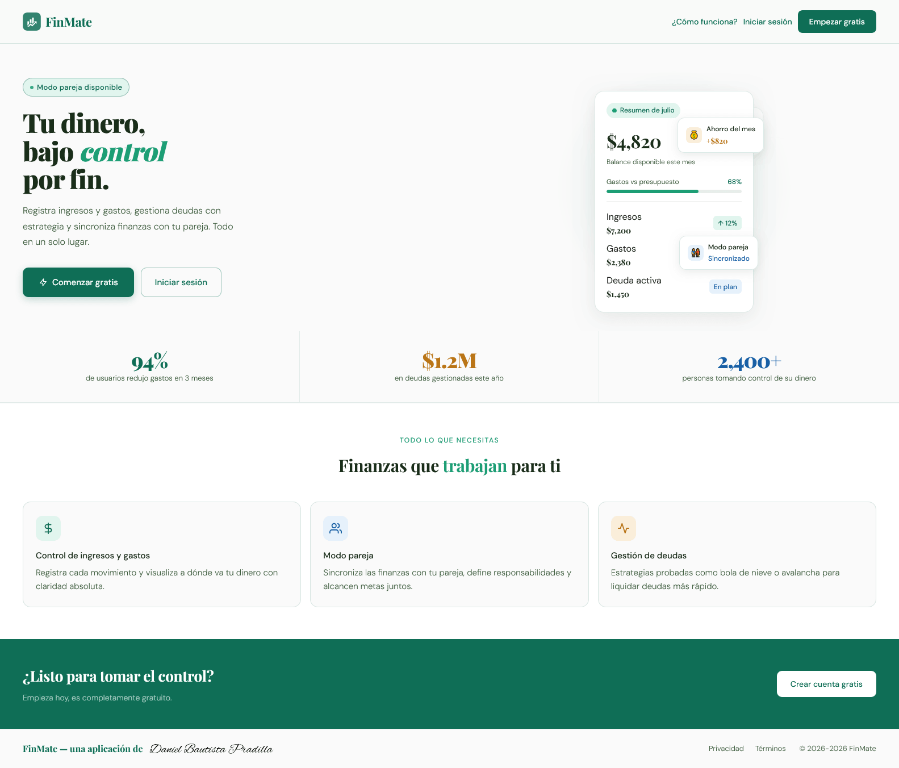

Inicio de sesión

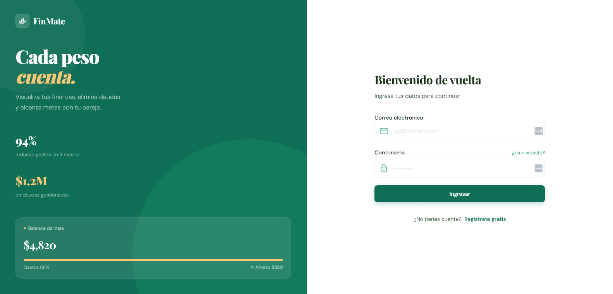

Registro

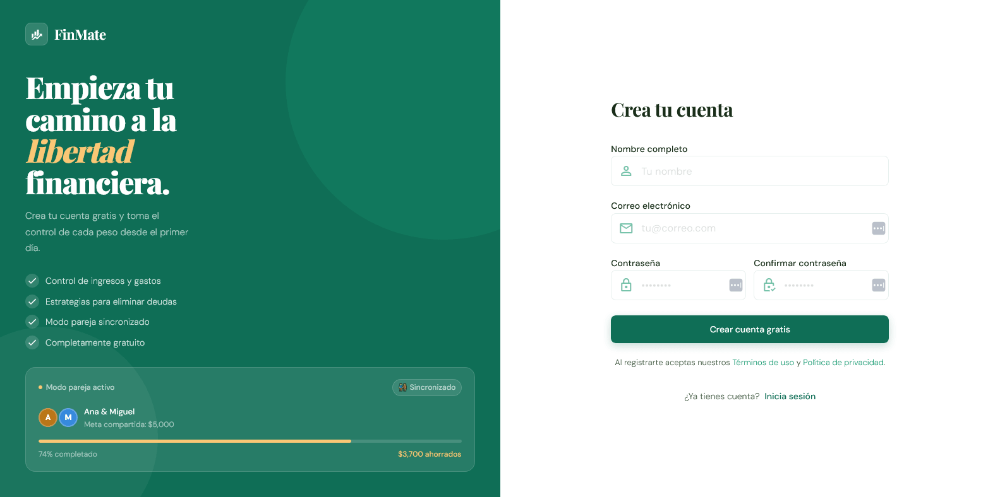

Cómo funciona

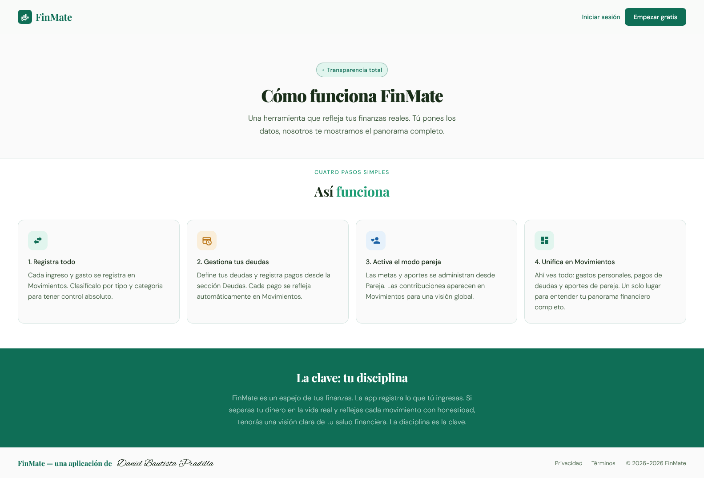

### Con sesión iniciada

Dashboard

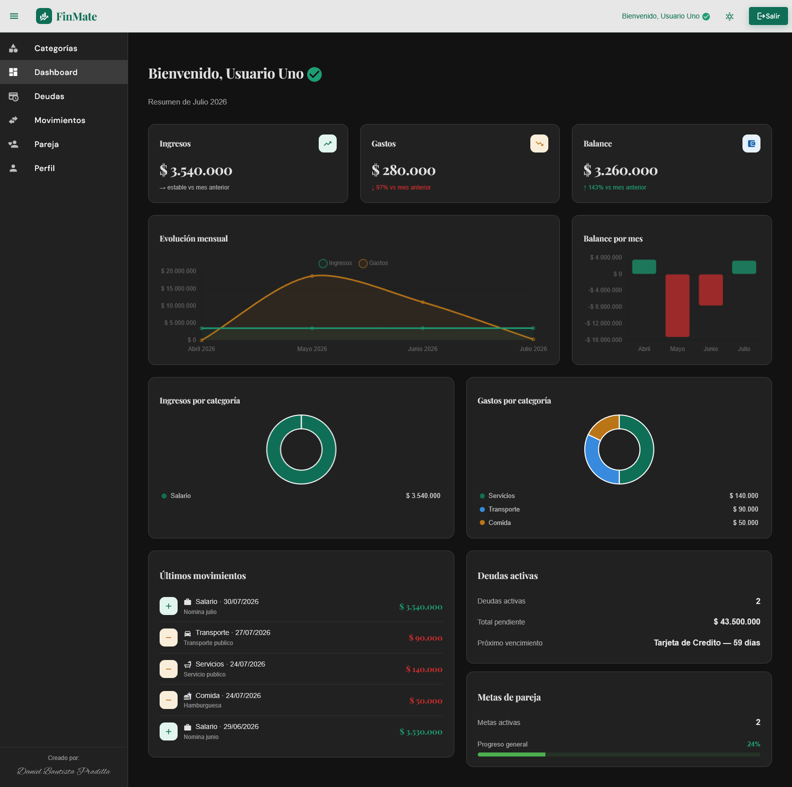

Categorías

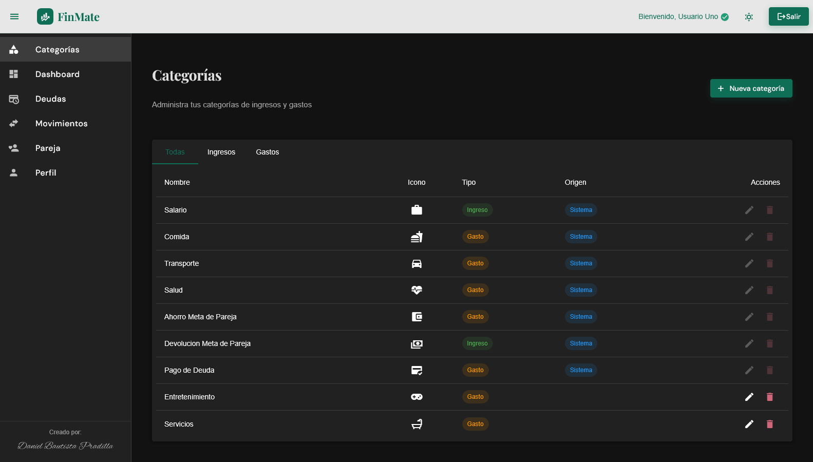

Movimientos

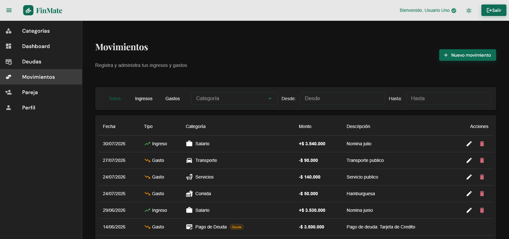

Deudas

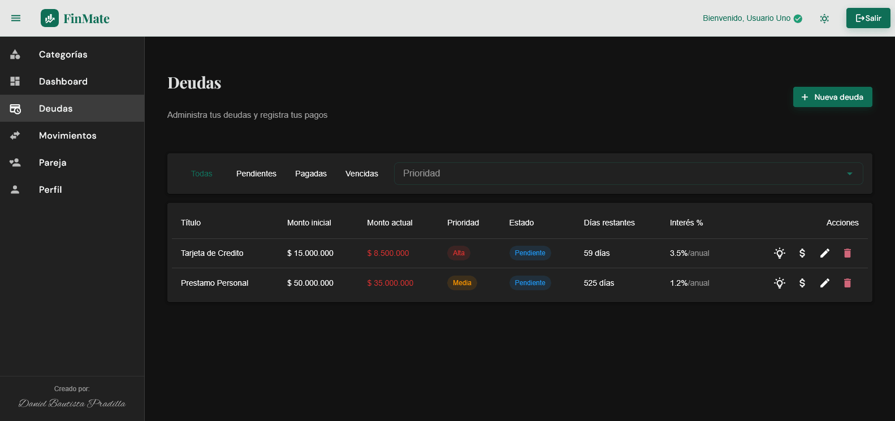

Plan de pago

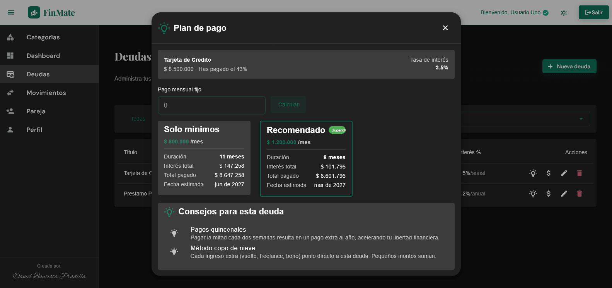

Pareja

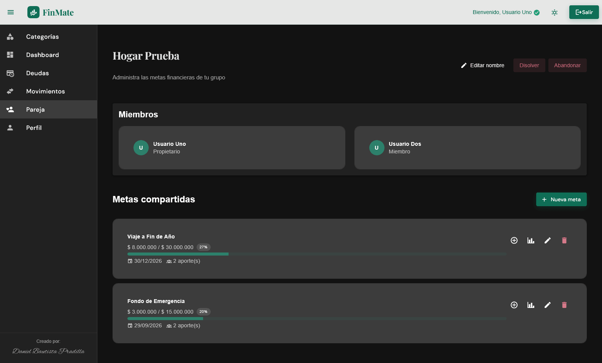

Metas de pareja

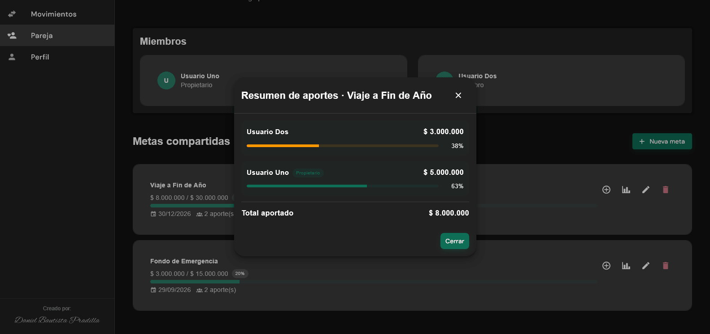

